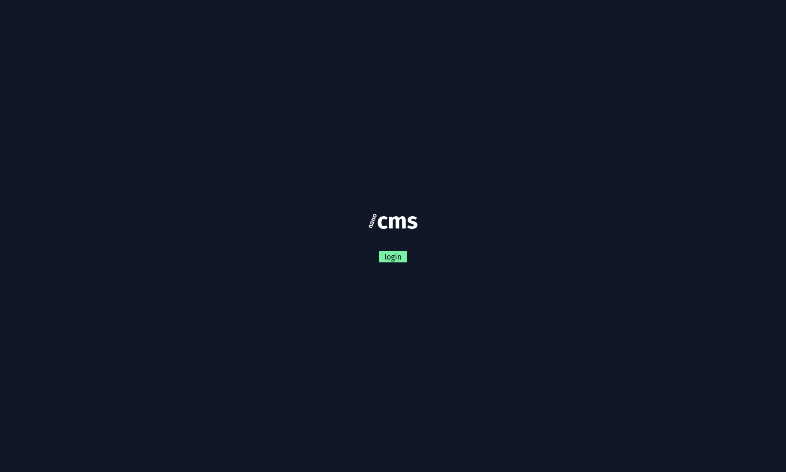
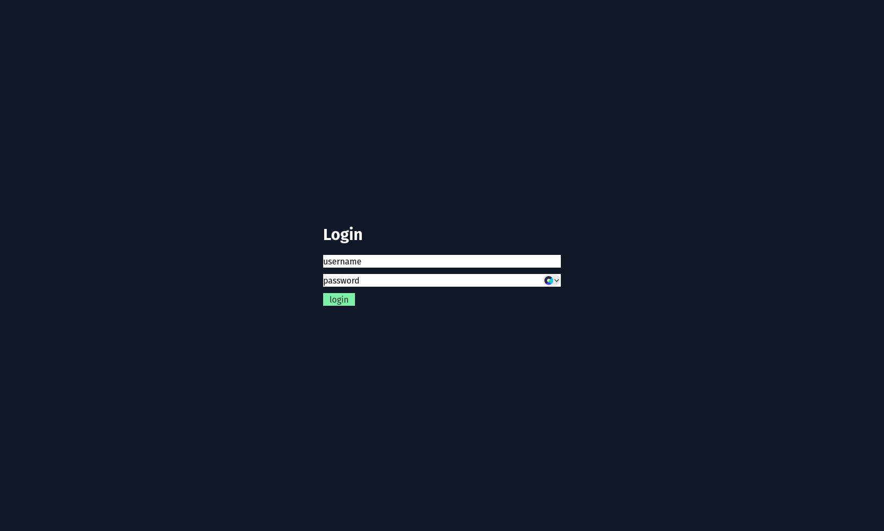
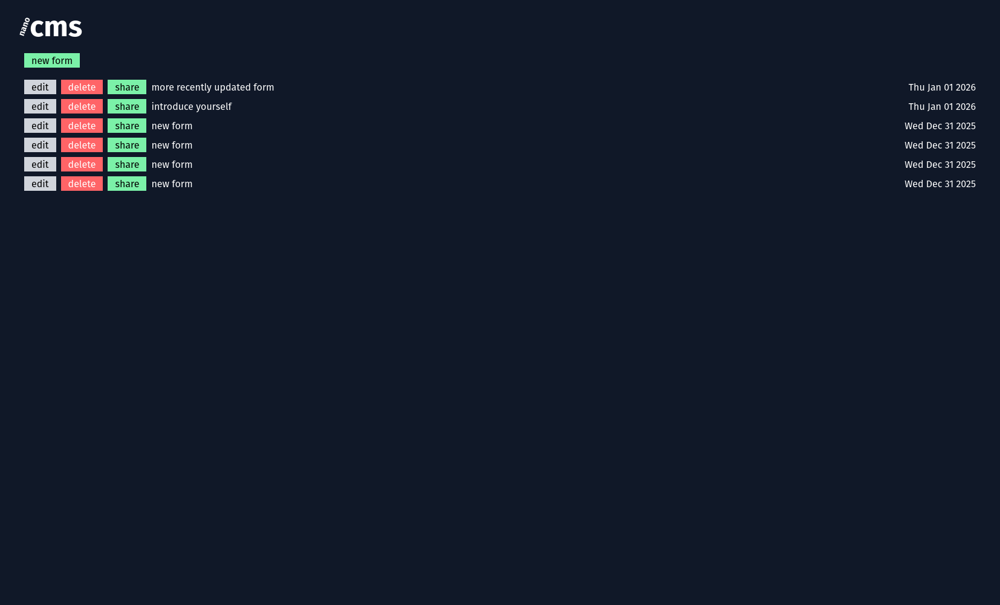
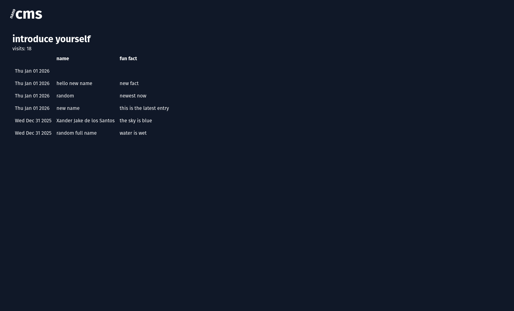
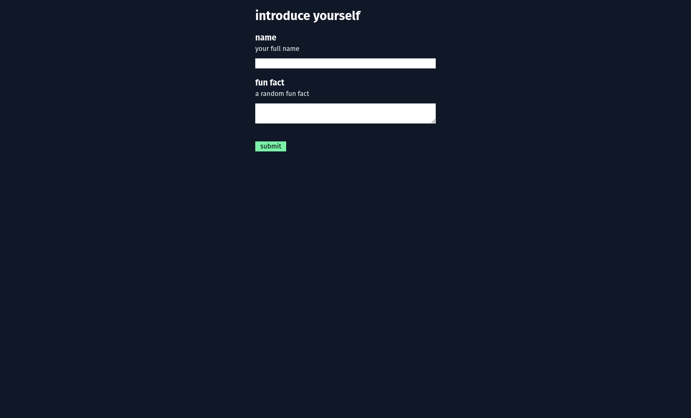
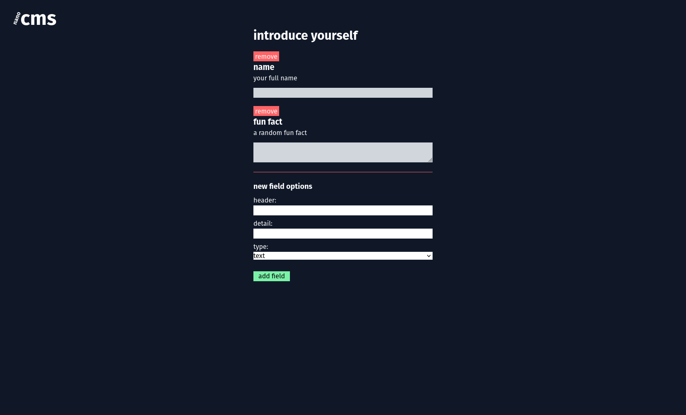

# nanocms

This is a small project is to familiarize myself with using a specific tech stack:
- backend: [django](https://www.djangoproject.com/start/overview/) (python)
- frontend: [react](https://react.dev/) (js/ts)
- database: [postgres](https://www.postgresql.org/)

This was supposed to be a content management type application but I decided to
tighten the scope. Now it is a form creation app where:
- `admin` users can `create/update/delete` a form 
- `admin` users can share the form to `unauthenticated` users
- `unauthenticated` users can fill out and submit the form
- `admin` users can view the entries for a specific form

I created [figma](https://www.figma.com/design/826EV76yOultIfZSdtEVE7/nanocms?node-id=0-1&t=Y4x9caLMp6NYiXxe-1) 
design to visualize the idea holistically. The current implementation doesn't
match the original design but it's getting there, polish takes the most time.

The official django documentation was helpful in figuring out specific ways
on how to do things in the django framework, like interacting with the database
and using it's builtin project management `cli`. I'm not sure if I did something
wrong with my LSP setup, sometimes I don't don't get any type definitions for
things I imported.

# file organization
These are the interesting files where I wrote most of my code:
- [django views](./backend/api/views.py) - everything is in one file to keep it simple
- [django tests](./backend/api/tests.py) - I like that django has a builtin testing library, it's very useful since all of my errors are discrovered at runtime
- [react components](./frontend/src/components/)
- [react-router setup](./frontend/src/main.tsx) - next step would be to use a data-fetching library, there are currently some unnecessary requests for existing data that lives in a different component


# project setup
I always like to add convenience scripts with tools like [just](https://just.systems/man/en/)
but it didn't seem to work well for this project so I opted for shell scripts
and aliases instead. I am using [nushell](https://www.nushell.sh/) so I have a
[setup.nu](./backend/setup.nu) that helps me not forget any setup steps when
getting back to the project after rebooting my computer. There are still things
to do manually because I haven't figured out how to automate them with a script
yet.

Tools to install:
- [uv](https://docs.astral.sh/uv/)
- [npm/node](https://nodejs.org/en)
- [podman](https://podman.io/) or docker
- [psql](https://dev.to/tigerdata/how-to-install-psql-on-mac-ubuntu-debian-windows-am)
- [ngrok](https://ngrok.com/)
- [caddy](https://caddyserver.com/)
- [nushell](https://www.nushell.sh/) is optional, the setup.nu script can be easily rewritten in other shell scripts


## backend
Add a `.env` file within the `./backend/` directory with the following contents:
```
# used to connect to the postgres server
user="postgres_user" #defaults to "postgres"
password="postgres_password"
host="localhost"
port="5432"
secret_key="some_long_secret_string"

# these values will be used by the setup script to create a default test user
DJANGO_SUPERUSER_USERNAME="super_user_username"
DJANGO_SUPERUSER_EMAIL="super_user@email.com"
DJANGO_SUPERUSER_PASSWORD="super_user_password"
```

### postgres
Start a postgres server. I am using [podman](https://podman.io/), docker should
work as well. Run the command in the terminal:
```
podman run -e POSTGRES_PASSWORD=postgres_password -p 5433:5432 -d postgres
```
Connect to the postgres server with `psql` and create the `nanocms` database:
```
psql -h localhost -p 5432 -U postgres
```
It will ask for a password, enter the password used in the previous command.

In the psql shell (the line should start with `postgres=#`), run:
```
create database nanocms;
```

### django
I'm using [uv](https://docs.astral.sh/uv/) to manage my python environment.
Within the `./backend/` directory, create a virtual environment.
```
uv venv
```
This will create a `.venv` with generated files that will be used by [setup.nu](./backend/setup.nu).
Run the setup script within the `./backend/` dir:
```
source setup.nu
```
The setup scripts loads environment variables in `.env`, activate the virtual
environment, run the django `migrate` command, and creates the default test user
if it doesn't exist yet.

It also creates an alias for `python manage.py` as `pm` so it's a bit faster 
to run `django` commands.

Run the django development server:
```
pm runserver
```

## frontend
Install frontend dependencies. Within the `./frontend/` directory, in a new
terminal run:
```
npm i
```

Run the development server:
```
npm run dev
```

## deployment

This project is not fully set up for deployment. Instead, I'm using [ngrok](https://ngrok.com/)
to forward requests from an ngrok enpoint URL to a local port. I could tunnel
both the django(`:8000`) and the react(`:5173`) dev servers but the free version is
limited to one at a time.

I used [caddy](https://caddyserver.com/) as a reverse proxy for the backend
`api` and a fileserver for the generated files of the built react app. More
details in the [Caddyfile](./Caddyfile).

In the `./frontend/` directory, run:
```
npm run build
# or to ignore typescript warning/errors
npm run build_no_warn
```

Run caddy server in a new terminal:
```
caddy run --config /path/to/Caddyfile
```
If you are in the root directory `./`:
```
caddy run --config Caddyfile
```
The caddy server will listen to port `:8080` as defined in the
[Caddyfile](./Caddyfile).

Start an HTTP tunnel with ngrok:
```
ngrok http 8080
```
`ngrok` should output a public URL that can be shared and let other people
interact with the webapp running locally.

# Screenshots












